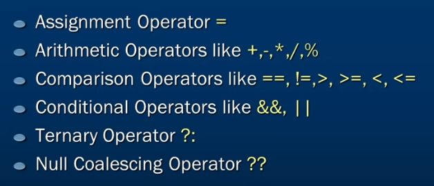
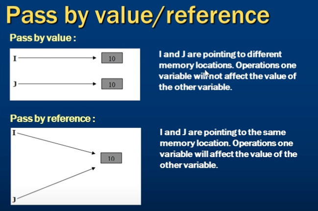

# Intro to C Sharp and .Net Framework:

## To start a new c# app:
```s 
dotnet new console -o Program10 -f net6.0
```
## Run App:
```s 
dotnet run 

```

**Using the namespace decalration, using System; indicates that you arte using the system namespace**
- A namespace is used to organize your code and is a collection of classes interfaces, structs, enums, and delegates.

## Built In Data Types in C#:
* Boolean
* Floating Types: float & double
* Decimal Types
* String Type
* Integral Types - sbyte, byte, short, ushort, int, uint, long, ulong, char (examples below)

***    
### Escape Sequences:


## Assignment Operators:


## Type Catagories:


## Implicit and Explicit Conversion:


## Difference Betwwen Parse and Try Parse:


## Arrays:


## Comments: 


## Switch Statements:


## While Loops:

## Do While Loops:


## For Loops:

## Foreach Loops:


# Methods:



    - The difference between arguments and parameters
    is that params are what is required by the method
    and are only found where you write the method.
    Where you call the method you pass in arguments.
