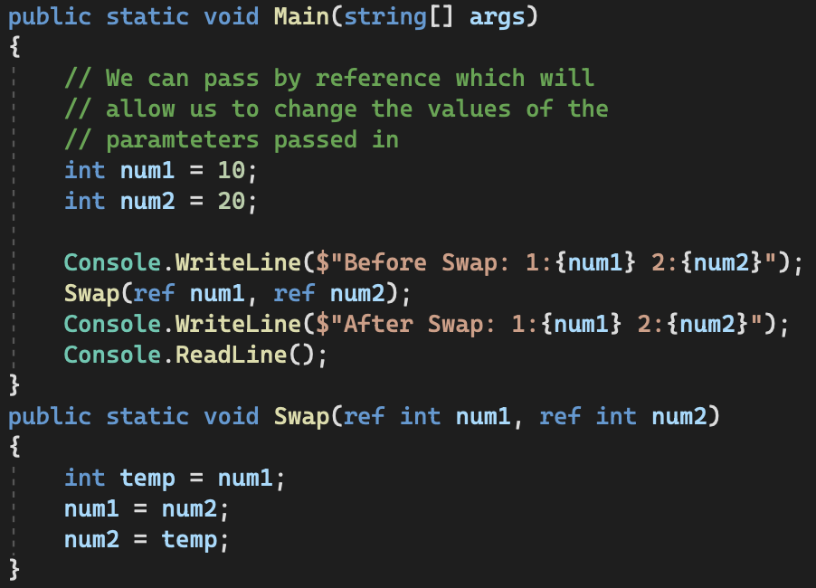
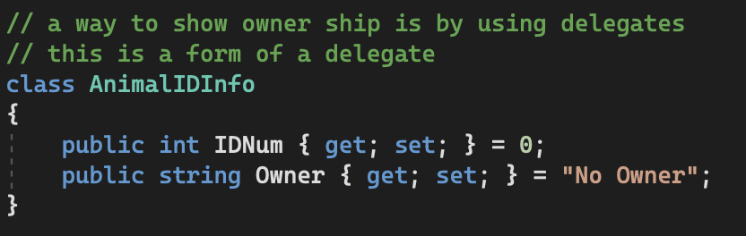

# C# Notes:       
[Link](https://www.youtube.com/playlist?list=PLGLfVvz_LVvRX6xK1oi0reKci6ignjdSa)       
### Basics:       
For Loop:       
            
Numbers:       
     
Args-For:       
     
Date:       
     
Time:       
     
Other-Data_types:       
     

## Arrays:       
Basics:       
       
Methods:       
       
Custom Array Functions and Find:       
       

### StringBuilder:       
      
      
      

### Conditionals:       
       
       
       
       
       
       
       

### Methods and Enum:       
       
       
       
       
       
       

### Enums:        
          
          

## Structs:
- Are similar to classes but are contained
    within a class, therefore they cannot
    be inherited from.
          

## Classes & OOP:
       
       
       
       
        

      
      
      
      

#### Inheritance
         
         
         
         
         
         

# Polymorphism:
        
        
        